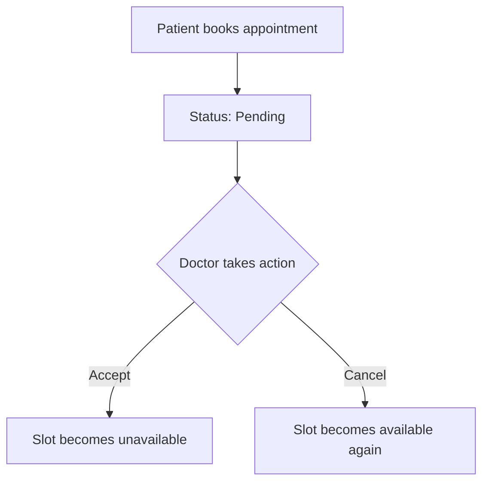

#  MediBridge – Doctor & Patient Appointment API

A powerful RESTful API built with **Node.js**, **Express**, **TypeScript**, and **MongoDB** that facilitates seamless doctor–patient interactions. It allows doctors to register, define services and availability, while patients can discover doctors, view their profiles, and request appointments.

---

## ✅ Key Features

### 🧑‍⚕️ For Doctors

- Secure account creation and login
- Manage medical services (Add/Update/Delete)
- Configure daily availability and time slots
- View and handle appointments (Accept, Cancel, Complete)

### 👩‍💼 For Patients

- Register/Login to the system
- Search doctors using filters (hospital, department, services)
- View detailed doctor profiles including availability
- Book and track appointments (with status updates)

### 🔐 Auth System

- JWT-based login
- Role-based access (Doctor / Patient)
- Passwords stored securely using **bcryptjs**

---

## ⚙️ Tech Stack

- **Backend:** Node.js, Express, TypeScript
- **Database:** MongoDB, Mongoose
- **Authentication:** JWT, bcryptjs
- **Validation:** Zod
- **Testing:** Jest + Supertest
- **Formatting:** Prettier + ESLint


---
## 📦 API Endpoints Summary

### 🔐 Auth Routes

| Method | Endpoint             | Description              |
|--------|----------------------|--------------------------|
| POST   | /auth/login          | User Login (JWT Token)   |
| POST   | /auth/register-doctor | Register Doctor          |
| POST   | /auth/register-patient | Register Patient        |
| GET    | /auth/me             | Get Logged-in User Info  |

---

### 👨‍⚕️ Doctor Routes

| Method | Endpoint               | Description                        |
|--------|------------------------|------------------------------------|
| POST   | /doctor/services       | Create a Service                   |
| PATCH  | /doctor/services/:id   | Update a Service                   |
| DELETE | /doctor/services/:id   | Delete a Service                   |
| GET    | /doctor/services       | Get All Services of Doctor         |

| Method | Endpoint                  | Description                       |
|--------|---------------------------|-----------------------------------|
| POST   | /doctor/availability      | Create Availability               |
| PATCH  | /doctor/availability/:id  | Update Availability               |
| GET    | /doctor/availability      | Get Doctor Availability           |

| Method | Endpoint                   | Description                         |
|--------|----------------------------|-------------------------------------|
| GET    | /doctor/appointments       | Get Appointments for Logged-In Doctor |
| PATCH  | /doctor/appointments/:id   | Update Appointment Status           |

| Method | Endpoint        | Description                  |
|--------|------------------|------------------------------|
| GET    | /doctor          | Get All Doctors              |
| GET    | /doctor/:id      | Get Specific Doctor Profile  |

---

### 👩‍⚕️ Patient Routes

| Method | Endpoint              | Description               |
|--------|------------------------|---------------------------|
| GET    | /patient/profile       | Get Logged-In Patient Info |
| GET    | /patient/appointment   | Get My Appointments        |

---

### 📆 Appointment Routes

| Method | Endpoint    | Description           |
|--------|-------------|-----------------------|
| POST   | /appointment | Book an Appointment   |

---

### 🏥 Hospital Routes

| Method | Endpoint          | Description           |
|--------|-------------------|-----------------------|
| POST   | /hospital/create  | Create Hospital       |
| GET    | /hospital         | Get All Hospitals     |
| GET    | /hospital/:id     | Get Single Hospital   |

---

### 🧬 Specialization Routes

| Method | Endpoint                  | Description               |
|--------|---------------------------|---------------------------|
| POST   | /specialization/create    | Create Specialization     |
| GET    | /specialization           | Get All Specializations   |
| GET    | /specialization/:id       | Get Specialization by ID  |

---


## 📊 Appointment Status Flow



---

## 📁 Project Directory Structure

```
/src
├── app/               # Express setup
├── modules/           # Feature modules
│   ├── auth/          # Login/Register logic
│   ├── user/          # Shared user logic
│   ├── doctor/        # Doctor-specific features
│   ├── patient/       # Patient features
│   ├── service/       # Doctor-provided services
│   ├── hospital/      # Hospital data
│   ├── specialization/ # Medical departments
│   ├── appointment/   # Appointment system
│   └── availability/  # Availability setup
├── utils/             # Utilities
├── middlewares/       # Custom middleware
├── config/            # Environment config
├── app.ts             # Entry app logic
└── server.ts          # Main server entry point
```

---

## 🚀 Getting Started

### 🔧 Prerequisites

- Node.js v20+
- MongoDB v4.4+
- TypeScript v4.7+

### 1️⃣ Clone the Repository

```bash
git clone https://github.com/Sajjadhosenshohan/dr-tech-backend-api
cd medibridge-api
```

### 2️⃣ Install Project Dependencies

```bash
yarn install
```

### 3️⃣ Configure Environment Variables

```bash
PORT=5000
DB_URL=mongodb+srv://<username>:<password>@<cluster-url>/<database-name>?retryWrites=true&w=majority
NODE_ENV=development
BCRYPT_SALT_ROUNDS=12
JWT_ACCESS_TOKEN_SECRET=your_random_long_secret_key
JWT_ACCESS_EXPIRES_IN=10d
SM_PASS=your_email_app_password

```

Then open `.env` and set appropriate values.

### 4️⃣ Start the Server

```bash
# Development
yarn dev

# Production
yarn build
yarn start
```

---

## 🧪 Testing the API

Use the following Postman collection to test all endpoints:

👉 [Postman Collection Link](https://bongodevs-1923.postman.co/workspace/Level-2~616dd9f1-a8b1-4b9c-998d-750ff4705975/collection/37579050-b613b686-5613-4828-a092-48a66b30909b?action=share&creator=37579050)

---

## 🌍 API Base URLs

| Mode        | Base URL                                      |
|-------------|-----------------------------------------------|
| 🔴 Live     | [`https://medibridge-api.vercel.app`](https://medibridge-api.vercel.app) |
| 🧪 LocalDev | `http://localhost:5000`                       |

---

## 🔐 Sample Auth Requests

### 🧑 Register Doctor

```http
POST /auth/signup-doctor
```

**Request Body**

```json
{
  "name": "Dr. Alex",
  "email": "alex@clinic.com",
  "phone": "01712345678",
  "password": "password123",
  "specialization": "60abc123...",
  "hospitalName": "60def456..."
}
```

---

### 👩 Register Patient

```http
POST /auth/signup-patient
```

```json
{
  "name": "Sana Roy",
  "email": "sana@example.com",
  "phone": "01876543210",
  "password": "mysecurepass",
  "age": 28,
  "gender": "Female"
}
```

---

### 🔑 Login

```http
POST /auth/signin
```

```json
{
  "email": "sana@example.com",
  "password": "mysecurepass"
}
```

---

## 🧑‍⚕️ Doctor Endpoints

### ➕ Create a Service

```http
POST /doctor/services
```

```json
{
  "title": "Diabetes Consultation",
  "description": "Routine checkup for diabetes",
  "price": 1000,
  "duration": 30
}
```

---

### 🕒 Set Availability

```http
POST /doctor/availability
```

```json
{
  "service": "SERVICE_ID",
  "day": "Wednesday",
  "slots": ["9:00 AM", "11:00 AM", "2:00 PM"]
}
```

---

### 🔁 Change Appointment Status

```http
PATCH /doctor/appointments/:id/status
```

```json
{
  "status": "accepted"
}
```

---

## 👩‍⚕️ Patient Endpoints

### 🔍 Browse Doctors

```http
GET /doctors?hospitalName.name=Green Life&specialization.name=Neurology
```

---

### 👁 View Doctor Profile

```http
GET /doctors/:id
```

---

### 📅 Book an Appointment

```http
POST /appointments
```

```json
{
  "doctorId": "DOCTOR_ID",
  "serviceId": "SERVICE_ID",
  "selectedDate": "2025-07-01",
  "timeSlot": "10:00 AM"
}
```

---

### 📜 My Appointments

```http
GET /patient/appointments
```

---

## ✨ Developer

**MD Shohan Sajjad**  
📧 Email: [mdshohansajjad@gmail.com](mailto:mdshohansajjad@gmail.com)  
🔗 GitHub: [@Sajjadhosenshohan](https://github.com/Sajjadhosenshohan)

---
